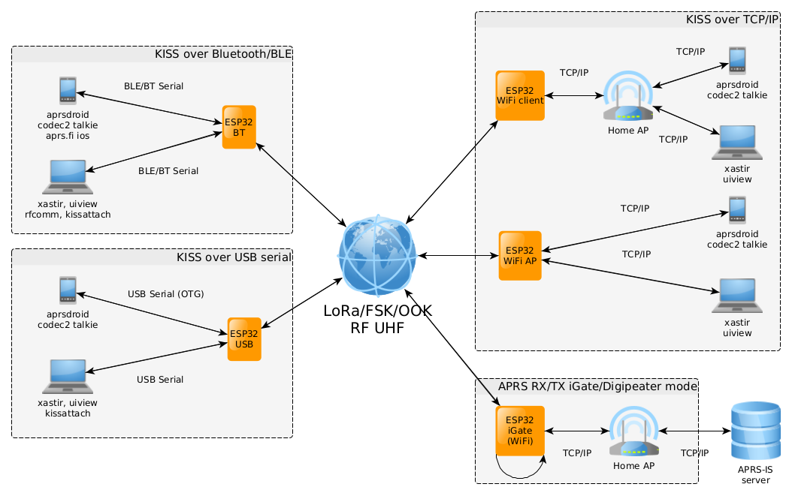
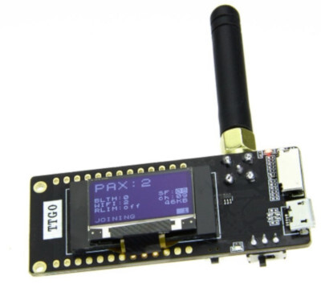
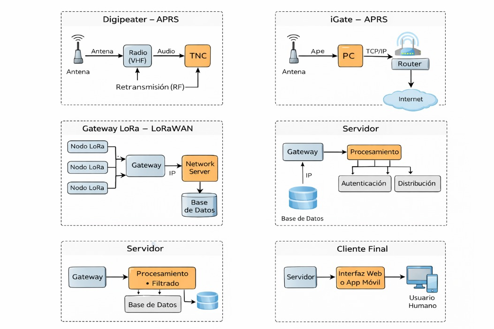

#  Fundamentos de LoRa/APRS

##  ¿Qué es LoRa?

LoRa (Long Range) es una tecnología de comunicación inalámbrica diseñada para:

- Comunicación de larga distancia  
- Bajo consumo energético  
- Aplicaciones IoT (Internet of Things)

LoRa define la modulación utilizada en la capa física (PHY) del modelo OSI, basada en Chirp Spread Spectrum (CSS). Protocolos como LoRaWAN se encargan de implementar la capa de enlace (MAC) y la gestión de red sobre esta modulación.

Es ideal para dispositivos que necesitan transmitir pequeñas cantidades de datos a grandes distancias, como:

- Seguimiento de vehículos  
- Agricultura inteligente  
- Logística  
- Sensores remotos  

---

##  ¿Qué es APRS?

APRS (Automatic Packet Reporting System) es un sistema de comunicación digital utilizado principalmente por radioaficionados para el intercambio de información en tiempo real.

###  Información que puede transmitir:

- Ubicación GPS  
- Datos meteorológicos  
- Mensajes cortos  
- Alertas de emergencia  
- Telemetría  

APRS utiliza:

- Modulación AFSK (Audio Frequency-Shift Keying) en FM  
- Velocidad de 1,200 baudios  
- Tonos de 1,200 Hz y 2,200 Hz  
- Protocolo AX.25  

---

##  Funcionamiento de la Red APRS

Una red APRS tradicional puede estar compuesta por:

- Estaciones transmisoras  
- Digipeaters (repetidores digitales)  
- iGate (puerta de enlace a Internet)  

Cuando se conecta a Internet, se integra a APRS-IS (Internet System), permitiendo visualización global.

En Internet existen múltiples plataformas donde se pueden visualizar mapas con estaciones APRS activas alrededor del mundo.

---

## Frecuencias de Operación

### Referencias Internacionales

#### APRS Tradicional (Packet Radio)

Las frecuencias de operación de APRS varían según la región y corresponden a convenciones adoptadas por la comunidad de radioaficionados.

- Europa: 144.800 MHz (VHF)
- América: 144.390 MHz (VHF)

Estas frecuencias se utilizan dentro de las bandas atribuidas al Servicio de Radioaficionados en cada país.

---

#### LoRa APRS

En implementaciones experimentales de LoRa APRS se han utilizado frecuencias como:

- 433.775 MHz (UHF)

En estos casos se emplea modulación LoRa en lugar de AFSK tradicional.

---

### Consideración Regulatoria en Costa Rica

En Costa Rica, la operación en cualquier banda de frecuencia debe ajustarse a lo establecido en el **Plan Nacional de Atribución de Frecuencias (PNAF)**.  

Las bandas específicas aplicables y los límites de potencia radiada se desarrollan en la sección de Legislación Costarricense de este documento.  

---

##  ¿Qué es LoRa APRS?

LoRa APRS combina ambas tecnologías, no utiliza el protocolo AX.25 tradicional en su forma clásica, sino implementaciones adaptadas del formato APRS sobre modulación LoRa.

- La eficiencia energética y largo alcance de LoRa  
- El sistema de posicionamiento y mensajería de APRS  

Esto permite crear una red de comunicación:

- De bajo consumo  
- De largo alcance  
- Robusta y eficiente  

Ideal para experimentación en radioafición y proyectos técnicos.

---

##  Uso Exclusivo para Radioaficionados

Tanto APRS como LoRa APRS:

- Requieren licencia de radioaficionado  
- Exigen identificación mediante indicativo  
- Utilizan frecuencias asignadas al servicio de radioaficionados  

---
## Disponibilidad de Módulos ESP32 con LoRa en el Mercado
  
Para la implementación práctica de sistemas LoRa/APRS, existen módulos comerciales que integran en una sola placa:  

### Microcontrolador ESP32    
Trae: 
- Transceptor LoRa (SX1276 o SX1278)
- Conectividad WiFi y Bluetooth  
- Receptor GPS (a veces)

Estos módulos permiten desarrollar nodos LoRa de manera rápida sin necesidad de diseñar circuitos RF desde cero.  

---

### TTGO T-Beam  
El TTGO T-Beam es una placa de desarrollo que integra: 

- ESP32 (WiFi + Bluetooth)  
- Transceptor	SX1276 (868/915 MHz) o SX1278 (433 MHz)
- Receptor GPS integrado  
- Conector para batería 18650  
- Antenas externas para LoRa y GPS  

Aplicaciones típicas: 

- Rastreo GPS en LoRa APRS  
- Telemetría remota  
- Monitoreo ambiental  
- Prototipos académicos IoT  

---

### Heltec WiFi LoRa 32  
El Heltec WiFi LoRa 32 es otro módulo ampliamente utilizado que integra: 

- ESP32  
- Transceptor LoRa (usualmente SX1278)  
- Pantalla OLED  
- Pines GPIO accesibles  
- Conectividad	WiFi / Bluetooth    

Aplicaciones típicas:  
- Nodos LoRa  
- Visualización local de datos  
- Redes experimentales LoRa  
- Proyectos académicos de comunicaciones  

---

### SX1276  
El SX1276 es un transceptor LoRa que opera típicamente en: 868 MHz y 915 MHz  
Implementa modulación Chirp Spread Spectrum (CSS) y es ampliamente usado en redes LoRaWAN y aplicaciones de largo alcance.  

---

### SX1278  
El SX1278 es una variante orientada principalmente a la banda de: 433 MHz  
Es común en implementaciones experimentales y proyectos de radioaficionados que utilizan esa banda.  

---

### Integración ESP32 + LoRa  
En estos módulos, el ESP32 y el transceptor LoRa se comunican mediante interfaz SPI.  
El ESP32 se encarga de:  

- Configurar parámetros LoRa (SF, BW, CR)  
- Procesar datos del GPS o sensores  
- Gestionar transmisión y recepción  
- Implementar lógica de aplicación  
- Enviar datos vía WiFi  

Estos módulos son fáciles de adquirir en tiendas en línea, soportados por comunidades maker e IoT, compatibles con entornos de desarrollo como Arduino y PlatformIO y permiten:  

- Implementar nodos LoRa/APRS experimentales  
- Analizar parámetros físicos como Spreading Factor y Bandwidth  
- Realizar pruebas de alcance y sensibilidad  
- Diseñar redes de telemetría  
- Integrar sistemas GPS con comunicaciones RF  

---
## Arquitectura de Red

La arquitectura de un sistema LoRa/APRS puede involucrar diferentes componentes según se trate de una red basada en radioafición (APRS tradicional) o una red LoRaWAN.

<p align="center">
  
</p>

<p align="center">
  <strong>Figura 1.</strong> Diagramas general de estructura de red LoRa/APRS.
</p>

---

### Nodo (Cliente / Estación)

Es el dispositivo de usuario final.

Puede tratarse de:

- Rastreador GPS en un vehículo
- Estación meteorológica
- Sensor IoT
- Dispositivo móvil

Su función es:

- Transmitir datos (posición, telemetría, mensajes)
- Recibir información de otros nodos

En implementaciones LoRa/APRS, un nodo típico puede estar compuesto por:

- Microcontrolador (ej. ESP32)
- Módulo LoRa
- Receptor GPS
- Sistema de alimentación

<p align="center">
  
</p>

<p align="center">
  <strong>Figura 2.</strong> Ejemplo de Nodo LoRa/APRS, Tracker.
</p>

<p align="center">
  
</p>

<p align="center">
  <strong>Figura 3.</strong> wifi lora 32 pinout.
</p>

---

### Digipeater (Repetidor Digital) – APRS

Es una estación que:

- Recibe paquetes por radiofrecuencia (RF)
- Los retransmite en la misma frecuencia
- Extiende el alcance de la red mediante saltos sucesivos

Su objetivo es permitir que los paquetes lleguen a estaciones fuera del alcance directo.

Opera bajo reglas específicas para evitar bucles infinitos, como el algoritmo **New-N**, que controla la cantidad de repeticiones permitidas.

---

### iGate (Puerta de Enlace a Internet) – APRS

Es una estación que actúa como puente entre:

- La red de radiofrecuencia local
- La red global APRS-IS en Internet

Funciones principales:

- Recibir paquetes por RF y reenviarlos a APRS-IS
- Opcionalmente, transmitir hacia RF paquetes provenientes de Internet

Permite que estaciones locales sean visibles globalmente en plataformas cartográficas.

---

### Gateway LoRa – LoRaWAN

En redes LoRaWAN, el gateway es un dispositivo que:

- Escucha en múltiples canales y frecuencias
- Recibe mensajes de todos los nodos LoRa dentro de su cobertura
- Encapsula los paquetes
- Los reenvía a un servidor mediante conexión IP (Ethernet, WiFi o red celular)

A diferencia del iGate de APRS, el gateway LoRaWAN:

- No realiza procesamiento de red avanzado
- No gestiona autenticación
- No toma decisiones de enrutamiento

Su función principal es actuar como concentrador de tráfico RF hacia el servidor.

---

### Servidor

Es el componente central del sistema.

En el ecosistema APRS-IS:

- Existen servidores distribuidos que reciben, filtran y redistribuyen paquetes globalmente.

En una red LoRaWAN privada:

- Se encarga de la autenticación de dispositivos
- Control de acceso
- Gestión de red
- Almacenamiento de datos
- Optimización de parámetros (ej. ADR)

En el contexto APRS, también puede referirse al software que ejecuta un iGate para procesar y reenviar datos.

---

### Cliente Final

Es la aplicación o interfaz utilizada por el usuario para visualizar o interactuar con la red.

Puede ser:

- Software de escritorio
- Aplicación móvil
- Plataforma web con mapas
- Sistema de monitoreo técnico

Su función es mostrar en tiempo real:

- Ubicación de nodos
- Telemetría
- Mensajes
- Alertas

--- 

En términos arquitectónicos, APRS se basa en una red distribuida RF con repetidores digitales (digipeaters), mientras que LoRaWAN utiliza una arquitectura centralizada donde el servidor gestiona la red y la lógica de comunicación.

<p align="center">
  
</p>

<p align="center">
  <strong>Figura 4.</strong> Diagramas funcionales de microarquitectura.
</p>

---

## Capa Física y de Enlace (Modelo OSI) de LoRa

LoRa implementa la modulación en la capa física (PHY) del modelo OSI mediante Chirp Spread Spectrum (CSS).  
En arquitecturas LoRaWAN, la capa de enlace (MAC) se encarga del control de acceso y la optimización de red.

---

### Capa 1 – Física (PHY)

#### Spreading Factor (SF) – Factor de Dispersión

En LoRa, el Spreading Factor indica cuántos bits se transmiten por símbolo utilizando modulación Chirp Spread Spectrum (CSS).

El SF determina cuántos chips se usan para representar cada símbolo, la duración del símbolo y la velocidad de transmisión de datos.

Rango típico: SF7 a SF12.

Efecto:

- SF alto → cada bit se codifica en más chips, aumentando la resistencia al ruido y la sensibilidad del receptor (mayor alcance).
- SF bajo → transmisión más rápida, pero menor sensibilidad.

Un SF alto incrementa el *Time on Air*, lo que implica mayor consumo energético y mayor ocupación del canal.

---

#### Bandwidth (BW) – Ancho de Banda

Define el rango de frecuencias utilizado por la señal LoRa.

Valores típicos:

- 125 kHz  
- 250 kHz  
- 500 kHz  

Efectos:

- Mayor BW → mayor tasa de datos, menor sensibilidad.
- Menor BW → mayor sensibilidad y alcance, menor velocidad de transmisión.

---

#### Coding Rate (CR) – Tasa de Codificación

Es la tasa de corrección de errores hacia adelante (Forward Error Correction – FEC).

Se expresa como:

- 4/5  
- 4/6  
- 4/7  
- 4/8  

Un CR 4/8 implica que por cada 4 bits de información se transmiten 8 bits totales, agregando redundancia para mayor robustez frente a interferencias.

Un CR 4/5 ofrece menor redundancia, mayor eficiencia y menor protección frente a errores.

---

#### Sync Word – Palabra de Sincronización

Valor configurable que actúa como identificador de red a nivel físico.

Los receptores LoRa solo procesan transmisiones que coincidan con la Sync Word configurada.

Permite separar redes públicas y privadas dentro de la misma banda de frecuencia.

---

### Capa 2 – Enlace (MAC)

En redes LoRaWAN, la capa MAC se encarga de:

- Control de acceso al medio
- Confirmación de paquetes
- Gestión de canales
- Control de potencia
- Optimización de parámetros

#### ADR (Adaptive Data Rate)

Es un mecanismo de control que optimiza dinámicamente:

- Spreading Factor
- Potencia de transmisión
- Velocidad de datos

El servidor de red analiza parámetros como RSSI y SNR de transmisiones recientes y ordena al nodo ajustar su configuración para maximizar eficiencia energética y capacidad total de la red.

---

### Modelo OSI APRS

Desde el punto de vista del modelo OSI, APRS se estructura de la siguiente manera:

- **Capa 1 – Física:** Modulación AFSK sobre portadora FM.
- **Capa 2 – Enlace:** Protocolo AX.25 para el encapsulamiento y direccionamiento de tramas.
- **Capas superiores:** Integración con APRS-IS cuando los paquetes son retransmitidos a través de Internet.

---

# Legislación Costarricense Aplicable a Sistemas LoRa / APRS

La regulación del espectro radioeléctrico en Costa Rica se rige por:

- **Plan Nacional de Atribución de Frecuencias (PNAF)**  
  Decreto Ejecutivo Nº 44010-MICITT  
  Publicado en el Alcance N°99 a La Gaceta N°95 del 30 de mayo de 2023.

- Reglamento General para la Regulación de los Trámites del Servicio de Radioaficionados  
  Decreto Ejecutivo Nº 40639-MICITT.

- Ley General de Telecomunicaciones Nº 8642.

El PNAF define:

- Atribución de bandas de frecuencia.
- Servicios autorizados en cada banda.
- Condiciones técnicas.
- Límites de potencia radiada (PIRE/EIRP).
- Clasificación de uso libre o concesionado.

---

# Bandas de Frecuencia Aplicables en Costa Rica

## Para Sistemas LoRa (Bandas de Uso Libre – Corto Alcance)

El PNAF contempla bandas para sistemas de baja potencia y corto alcance, utilizadas comúnmente para LoRa:

| Banda (MHz)         | Tipo de Uso        |
|---------------------|-------------------|
| 433.05 – 434.79     | Uso libre (SRD)   |
| 902 – 915           | Uso libre         |
| 915 – 921           | Uso libre         |
| 921 – 960           | Uso libre         |
| 2400 – 2500         | Uso libre (ISM)   |

Estas bandas pueden utilizarse sin concesión individual siempre que se respeten los límites técnicos establecidos.  
En el caso de las bandas de 921 - 960, estas bandas incluyen segmentos destinados a dispositivos de corto alcance y aplicaciones ISM, sujetos a condiciones técnicas específicas establecidas por el PNAF.

---

## Para APRS (Servicio de Radioaficionados)

APRS tradicional opera en bandas atribuidas al Servicio de Radioaficionados:

- Banda de 2 metros: **144 – 148 MHz**
- Frecuencia práctica utilizada en América: **144.390 MHz**

En este caso, la operación requiere:

- Licencia de radioaficionado vigente.
- Permiso de uso del espectro (título habilitante).
- Identificación mediante indicativo oficial.

---

# PIRE Permitida por Banda

Según el PNAF vigente, los límites máximos de Potencia Isotrópica Radiada Equivalente (PIRE/EIRP) son:

| Banda (MHz)         | PIRE Máxima | Equivalente en Watts |
|---------------------|------------|----------------------|
| 433.05 – 434.79     | 30 dBm     | 1 W |
| 902 – 915           | 30 dBm     | 1 W |
| 915 – 921           | 36 dBm     | ≈ 4 W |
| 921 – 960           | 30 dBm     | 1 W |
| 2400 – 2500         | 36 dBm     | ≈ 4 W |

Conversión:

P(W) = 10^((dBm - 30) / 10)

Ejemplo:

P(W) = 10^((30 - 30) / 10) = 1

El cumplimiento de estos límites es obligatorio incluso en bandas de uso libre.

---

# Permisos Requeridos

La exigencia depende de la banda utilizada.

---

## Caso A: APRS en Banda de Radioaficionado

Requisitos:

1. Aprobar examen técnico ante SUTEL.
2. Obtener licencia de radioaficionado.
3. Solicitar permiso de uso del espectro.
4. Operar bajo indicativo asignado.

---

## Caso B: LoRa en Banda de Uso Libre

No requiere concesión individual si:

- Se respeta la banda autorizada.
- No se excede la PIRE máxima.
- Se cumple con condiciones técnicas del PNAF.
- El equipo está homologado según normativa nacional.

---

# Mapa de Tiempo de Trámites (Servicio de Radioaficionados)

Según Decreto 40639-MICITT:

### Proceso de Licencia

| Etapa | Tiempo Máximo |
|-------|--------------|
| Traslado de solicitud a SUTEL | 10–20 días hábiles |
| Resolución de SUTEL | Hasta 20 días hábiles |
| Proceso completo de licencia | Hasta 60 días hábiles |

---

### Proceso de Permiso de Uso del Espectro

| Etapa | Tiempo Máximo |
|-------|--------------|
| Solicitud de criterio técnico | 5 días hábiles |
| Recomendación técnica SUTEL | Hasta 45 días hábiles |
| Resolución final | Hasta 60 días hábiles |

Flujo simplificado:

Solicitud → Evaluación técnica → Resolución SUTEL → Otorgamiento de permiso → Operación

## Clases de Emisión (Modulación)

Las clases de emisión se definen según el Reglamento de Radiocomunicaciones de la UIT (Apéndice 1).

Describen:

1. Ancho de banda necesario.
2. Tipo de modulación.
3. Naturaleza de la señal moduladora.
4. Tipo de información transmitida.

Formato general:

```
[AnchoBanda][TipoModulación][TipoSeñal][TipoInformación]
```

---

### APRS Tradicional (AFSK sobre FM)

Ejemplo representativo:

```
16K0F2D
```

Donde:

- 16K0 → 16 kHz de ancho de banda
- F → Modulación en frecuencia
- 2 → Una señal digital
- D → Transmisión de datos

---

### LoRa (Chirp Spread Spectrum)

LoRa utiliza modulación digital de espectro ensanchado.

Ejemplo conceptual:

```
125K0G1D
```

- 125K0 → 125 kHz de ancho de banda
- G → Espectro ensanchado
- 1 → Señal digital sin subportadora
- D → Datos

La designación exacta depende del ancho de banda configurado y de los parámetros reales del sistema.

--- 

# Plan de Proyecto (Gantt) — Componente: Tracker LoRa/APRS (12 semanas)

## Objetivo general
Diseñar e implementar un **tracker LoRa/APRS** capaz de adquirir posición GPS y transmitir paquetes mediante LoRa para su integración en una red tipo APRS.

## Objetivos específicos (máximo 3)
1. **Diseñar la arquitectura del tracker** mediante la selección e integración de hardware (ESP32, módulo LoRa y receptor GPS).
2. **Implementar el firmware del tracker** para la adquisición de datos GPS y la transmisión de paquetes utilizando tecnología LoRa.
3. **Evaluar el funcionamiento del sistema** mediante pruebas de comunicación y análisis del desempeño del tracker.

---

## Cronograma (Gantt — 12 semanas)

**Leyenda:** `███` = actividad en ejecución

| Fase | Actividad | S1 | S2 | S3 | S4 | S5 | S6 | S7 | S8 | S9 | S10 | S11 | S12 |
|---|---|:--:|:--:|:--:|:--:|:--:|:--:|:--:|:--:|:--:|:---:|:---:|:---:|
| Investigación | Estudio de LoRa y APRS | ███ | ███ |  |  |  |  |  |  |  |  |  |  |
| Diseño | Definición de arquitectura del tracker |  | ███ | ███ |  |  |  |  |  |  |  |  |  |
| Hardware | Selección de módulos y componentes |  |  | ███ | ███ |  |  |  |  |  |  |  |  |
| Configuración | Preparación del entorno de desarrollo |  |  |  | ███ | ███ |  |  |  |  |  |  |  |
| Firmware | Lectura de datos GPS |  |  |  |  | ███ | ███ |  |  |  |  |  |  |
| Firmware | Implementación comunicación LoRa |  |  |  |  |  | ███ | ███ |  |  |  |  |  |
| Integración | Integración GPS + LoRa |  |  |  |  |  |  | ███ | ███ |  |  |  |  |
| Pruebas | Pruebas de transmisión y recepción |  |  |  |  |  |  |  | ███ | ███ |  |  |  |
| Validación | Evaluación de desempeño (alcance/estabilidad) |  |  |  |  |  |  |  |  | ███ | ███ |  |  |
| Documentación | Redacción y cierre del informe |  |  |  |  |  |  |  |  |  | ███ | ███ | ███ |

---

### Link presentacion 
https://estudianteccr-my.sharepoint.com/:p:/g/personal/marstev34_estudiantec_cr/IQDLql-V3UTBTptVxMrIBcFQAcqZ-paEWw8ywhhay9LmOLQ?e=JOFPa7
